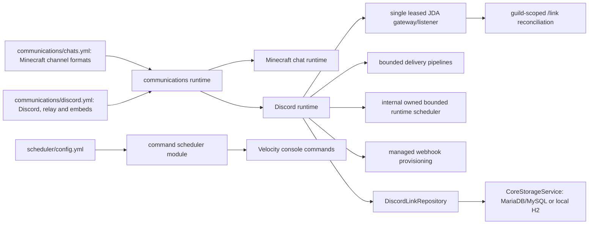

# TensaPlugin architecture, stability, and security audit

Audit date: 2026-08-09

Scope: TensaPlugin (Java 25 / Velocity 4 API) and the relevant TensaProxy
authentication and NeoForge advancement producer (Java 21 toolchain).

## Executive result

Chat and Discord now have one lifecycle owner, the neutral `communications`
module. Discord account links use `CoreStorageService` through JDBC instead of a
module-owned JSON file. Configuration schema v2 intentionally resets legacy
communications settings and links after a verified backup; it does not silently
carry unsafe or ambiguous old values forward.

Discord startup may degrade without disabling Minecraft chat. Targeted reload
validates a complete candidate before replacing the active runtime, and a failed
replacement restores the previous validated plan. The communications metrics
object survives that replacement, while JDA, listeners, queues, workers and
scheduled tasks belong to exactly one active runtime.

The follow-up chat/resource audit made player chat strictly webhook-delivered,
eliminated command-route formatting bypasses and chat moderation, emits real URL
click components, and separates internal lifecycle scheduling from the optional
configurable `scheduler` command module. Operational communications files now
live under `communications/`.

The authentication investigation confirmed two causes consistent with offline
players becoming frozen after transfers: route aliases were incorrectly treated
as equivalent when they shared a signed backend ID, and a lost authentication
challenge had no bounded retry. LibreLogin now remains the sole route owner and
TensaProxy retries unanswered initial and renewal challenges without weakening
replay protection.

No deployment, proxy reload, proxy restart, or backend restart was performed.
Real guild permissions, Discord reconnect behavior and mixed premium/offline
player routing remain canary gates.

## Resulting architecture

There is no static relay sink between separately managed modules. Runtime state
is instance-owned and closed during replacement.

## Confirmed findings and resolutions

| Severity | Confirmed issue | Resolution |
| --- | --- | --- |
| Critical | Guild `/link` registration depended on relay-channel readiness, causing Discord to report that the command was unavailable. | Registration is guild-scoped and independent from relay availability. Ready, Resume and recreated connections run one coalesced, idempotent reconciliation that verifies the resulting command and reports safe failure classes. |
| High | Slow acknowledgement and duplicate JDA listeners could produce Discord error 10062. | Matching interactions are deferred ephemerally before storage/role work. A process-local token-fingerprint lease permits one JDA runtime per bot, and close rejects new events, removes the listener, shuts JDA down with a deadline and releases the lease. Tokens are never logged. |
| High | `links.json` was module-local, bounded only at file load and disconnected from configured core storage. | `DiscordLinkRepository` uses `<prefix>discord_links` through `CoreStorageService`. UUID and Discord user ID uniqueness is transactional; conflict results remain `PLAYER_ALREADY_LINKED` and `DISCORD_ALREADY_LINKED`. A bounded bidirectional index is updated only after commit. Link codes remain short-lived in-memory state. |
| High | Legacy communications values could be ambiguous and could preserve unsafe routing assumptions. | Schema v2 archives `discord.yml`, `chats.yml` and legacy `links.json`, verifies every copied SHA-256, then atomically writes clean defaults. No old communications value or link is imported. Future schema versions fail without changing files. |
| High | `chat-manager`/`chat` and `discord` were separate lifecycle owners. | They are replaced by one `communications` module. Root module flags migrate once with destination-wins semantics; if the destination is absent, legacy booleans are OR-combined before old keys are removed. |
| High | A syntactically valid YAML value with the wrong type could silently fall back to a Java default during reload. | `chats.yml` and `discord.yml` now receive strict annotated-field type validation before missing defaults are written. A type error aborts the candidate and leaves the old runtime active. |
| High | Reload could duplicate listeners, JDA sessions, slash registration, tasks or workers. | A serialized atomic runtime slot validates first, closes the old runtime, starts the candidate and rolls back from its previous validated plan on failure. Five consecutive replacement tests assert one instance of every owned resource. |
| High | Existing `lang/uk.yml` did not gain new bundled keys. | Runtime localization merges only missing bundled keys and preserves manual values. The real `discord_link_code` template and its MiniMessage `COPY_TO_CLIPBOARD` action are tested; the click payload is exactly the raw code. |
| High | Relay guard and chat moderation were outside the plugin's responsibility and bloated Discord configuration. | Link-required relay blocking, reply deletion/cooldowns, duplicate suppression, repeated-character filtering and their state/tasks were removed. Channel access belongs to Discord roles and Minecraft permissions. `discord.yml` owns the relay direction, logical channel list and presentation; `chats.yml` owns Minecraft channel routes and formats without Discord keys. |
| High | `/pm` was absent from the default private aliases, malformed nested YAML could stringify as `{}`, and console commands inherited player wrappers. | The known old alias set migrates to `pm,msg,tell,w` without replacing manual aliases. Nested route types are validated before activation. Every route uses the same typed resolver: players receive configured public or private wrappers, while console invocations send only the trusted MiniMessage payload, including explicit-target `/r`. |
| High | Plain HTTP/HTTPS text had no Adventure click action, so the client could not open it even though the text was preserved. | `TextPipeline` detects bounded HTTP/HTTPS tokens after sanitization and inserts `OPEN_URL` plus hover actions while keeping all other user input literal. `/tensainfo communications` reports the number of URL actions produced; if that counter increases but clicks still fail, the remaining behavior is upstream client/modpack handling. |
| High | Minecraft-to-Discord identity formatting depended on a manually configured webhook and silently fell back to bot identity when it was absent or revoked. | Chat is webhook-only. The configured global webhook is used automatically; otherwise one bot-owned `ServerChat` webhook is recovered or created idempotently. Every message overrides username/avatar with the Minecraft identity. HTTP 400/401/404, timeout and 5xx never cross-fallback to bot chat; revoked credentials trigger coalesced recovery. `/tensainfo communications` reports only `explicit`, `managed`, `recovering` or `unavailable`. |
| High | Persisting a generated webhook URL would have stored a live secret, while storing only an ID could not detect token rotation. | `<prefix>discord_webhook_bindings` stores route, webhook ID and a SHA-256 token fingerprint only. The token/URL exists only in the active runtime, is never rendered by `toString` or logs, and is re-fetched from Discord after startup/reconnect. |
| High | Root-level communications files did not follow module ownership and could diverge from newly generated defaults. | Existing schema-v2 root files are backed up, hash-verified and atomically relocated byte-for-byte to `communications/`. Destination-wins handling archives and removes obsolete root copies. Schema reset/future-version guarantees remain unchanged. |
| High | Reconnect, status polling, webhook recovery and cleanup had separate scheduling/executor behavior, while the public `scheduler` id misleadingly exposed only that infrastructure and had no command configuration. | Internal consumers now create lifecycle-owned `ModuleScheduler` instances through a non-module factory. The optional `scheduler` module independently owns validated recurring console-command tasks in `scheduler/config.yml`; disabling or reloading it cannot affect Communications. Fixed/random intervals and all/random/shuffle/round-robin modes remain bounded and reload without duplicate jobs. |
| High | Expired link codes were removed only when queried or reissued, allowing stale entries to accumulate across many disconnected players. | The registry has a hard capacity, purges expiry on issue and receives a lifecycle-owned periodic cleanup. Link indexes, queues, event state and scheduler work are all bounded. |
| Medium | Public `discord.yml` exposed implementation tuning that normal operators should not need. | `limits`, `delivery`, `gateway`, `scheduler`, `backend_status`, link timing, avatar URL, webhook creation/name and moderation keys were removed from schema and parser. Existing v2 files prune these known obsolete keys idempotently; fixed conservative bounds remain in code. |
| Medium | There was no live evidence for heap regression or retained Communications state. | Runtime-only telemetry records startup-to-live heap delta, heap percentage, chat/reply/link state, scheduler jobs/queue/rejections, transport state and queue depths. Heap warnings are transition-only with recovery hysteresis, avoiding periodic log spam. |
| High | Discord delivery had duplicate-delivery risks and insufficient backpressure. | Ingress, normalization, formatting and delivery use bounded queues. Backoff with jitter is limited to definite retryable failures. Timeout/I/O does not trigger a second transport. Announcement embeds may fall back to bot plain text only after local validation or definite invalid-form rejection; player chat never changes transport. |
| High | Linking accumulated unrelated nickname and announcement effects. | Linking now owns only codes, durable association and configured linked-role assignment/removal. Role assignment is idempotent; the configured role is reconciled for all linked accounts on JDA Ready/reconnect and per linked player on connect/server-switch. With no role configured, no role API call occurs. |
| High | Backend advancement text depended on whichever component title happened to be visible at runtime. | TDE2 carries locale, localized title and optional description. TensaProxy embeds SHA-1-verified `uk_ua`/`en_us` vanilla catalogs and loads bounded mod language catalogs; TensaPlugin accepts strict TDE1 and TDE2 frames for rolling compatibility. |
| Critical | Auth route suppression treated two Velocity routes sharing a backend ID as the same route. Offline-auth players could remain attached to a gameplay backend while its gate stayed locked. | The alias-route mutation was removed. LibreLogin owns auth/gameplay routing. A signed backend ID is cryptographic identity, not route identity; exact physical endpoint aliases require a distinct auth endpoint. |
| High | A dropped initial or lease-renewal challenge left a backend player locked until timeout. | TensaProxy retries unanswered challenges at a bounded interval no faster than five seconds. Session/challenge identity is retained, while each retry has a fresh message ID, nonce, timestamps and signature. Any valid bound `AUTH_STATE` stops retries; exact replay remains rejected. |
| High | Blocking I/O and unbounded executors/queues existed in event or command paths. | Core user/storage operations, Discord work, command queue, text reader, HTTP and RCON work use plugin schedulers or bounded executors with explicit rejection. Socket, HTTP, JDA shutdown and executor waits have finite bounds. |
| Medium | Minecraft text had separate Message, chat and placeholder parsers, so ordering and escaping differed by route and valid click tags could be diagnosed only at a shallow renderer seam. | `TextPipeline` is now the single component boundary for contextual placeholders, curly/percent interpolation, legacy colors, MiniMessage, operator payloads and safe player-chat insertion. Player input is inserted as a Component, URL actions are explicit, and quoted tag arguments use a separate encoder. Discord Markdown continues to use its destination sanitizer but shares the same raw interpolation engine. Logs contain transitions, safe failure classes and counters, never message bodies, tokens, webhook URLs, Discord IDs, signatures or keys. |
| Medium | `/tensainfo communications` existed only behind the shorter `/tinfo` primary command. | `/tensainfo` is now primary and `/tinfo` remains its compatibility alias; both are reserved against chat-command collisions. The snapshot contains only state, backend type, queue/counter metrics, latency and a safe failure class. |
| Medium | NeoForge `sourcesJar` consumed the generated language catalog without a Gradle task dependency, so clean builds could fail based on task order. | `sourcesJar` now explicitly depends on catalog generation, matching `processResources`; the full clean multi-project build is deterministic. |

## Authentication audit details

Premium accounts appeared less affected because they can bypass or complete a
different LibreLogin path; this was not evidence that the backend freeze guard
itself was account-type aware. The actual fault was route ownership combined
with fail-closed backend state. The fixes retain the intended security model:

- a backend locks a player immediately and unlocks only after a valid, bound,
  signed `AUTHORIZED` state;
- malformed, expired, cross-player, cross-session and replayed frames cannot
  unlock a player;
- authorization remains a renewable lease;
- authentication reload validates changes but deliberately does not replace
  active sessions or move/kick connected players;
- security/timing changes to the auth runtime require the next controlled proxy
  start and are reported as such.

The remaining topology rule is operationally important: if `auth` and a
gameplay server are merely two names for the same physical listener, Velocity
cannot perform a meaningful transfer between them. Configure a genuinely
distinct auth endpoint instead of restoring alias suppression.

## Configuration and storage contract

Both `communications/discord.yml` and `communications/chats.yml` require
`config_version: 2`.

- Version `<2` or a missing version triggers verified archival followed by
  clean v2 defaults. Existing values are not merged.
- Version `>2` fails fast and leaves every source file untouched.
- A partial archive failure leaves every original in place and does not write
  the replacement files.
- Legacy `links.json` is removed only after its verified copy exists and is
  never imported into JDBC storage. Users must link again.
- Secrets have no generated defaults. Environment overrides remain available.
- Root schema-v2 files are verified and relocated into `communications/`; if a
  destination already exists it wins and the obsolete root file is archived.
- Managed webhook storage contains only IDs and token fingerprints, never URLs
  or tokens. Global chat webhook recovery/creation is automatic when no explicit
  webhook is configured.
- Link persistence follows `storage.type`: configured MariaDB/MySQL when
  selected and available, otherwise local H2 according to core-storage rules.
- Manual runtime language translations are preserved while missing bundled
  keys are added.

Full operator notes are in [COMMUNICATIONS_V2_MIGRATION.md](COMMUNICATIONS_V2_MIGRATION.md).

## Reload, concurrency and delivery audit

- `/tensareload <module-id>` targets exactly one enabled module;
  `/tensareload all` handles all enabled modules. No argument remains a
  compatibility alias for `all`.
- Permissions are `tensa.reload` and `tensa.reload.<module-id>`, including tab
  completion filtering.
- Communications config parsing, type validation, MiniMessage parsing, Discord
  IDs, webhook URLs, placeholders and embed limits are validated before runtime
  replacement. Technical queue/timing bounds are immutable code policy.
- Chat can stay active while initial Discord startup is degraded. Targeted
  communications reload is stricter: an operational activation failure restores
  the previous runtime rather than accepting a new degraded candidate.
- Inbound relay rejects bot/webhook/self and wrong guild/channel traffic. It
  does not require an account link; Discord roles own channel access policy.
- Metrics are module-owned, in-memory and monotonic across targeted reload;
  queues and workers are runtime-owned.
- Resource telemetry is safe and runtime-only. It reports counts and heap
  pressure transitions, never player/Discord identities or message bodies.
- Core authentication sessions, connected players and core storage are outside
  the communications replacement boundary.

## Verification

Final local gates:

- TensaPlugin with Java 25: `mvn -B clean test`,
  `mvn -B dependency:analyze`, and `mvn -B clean package`: 186 tests,
  0 failures/errors/skips, and no dependency problems.
- A clean Velocity 4 smoke profile binds only to localhost,
  strips Discord credentials from the child environment and disables telemetry.
  It verifies the built JAR against Velocity 4/Adventure 5 click-event bytecode,
  v2 config generation without secret defaults, UTF-8 Ukrainian localization
  sync, Communications degraded startup, the real MiniMessage URL
  template, Scheduler execution, five targeted Scheduler reloads without
  duplicate ticks, and clean module/storage/process shutdown.
- TensaProxy with its Java 21 toolchain: `gradlew.bat clean test build`.
  45 tests, 0 failures/errors/skips across testkit and NeoForge.
- Focused tests cover schema reset/archive failure/future rejection, H2 schema
  and conflicts, restart persistence, non-import of JSON, role reconciliation,
  strict webhook-only delivery, webhook binding/provisioning/revocation, route
  formatting and nested type rejection, the unified placeholder/text pipeline,
  URL components, command scheduler config/random modes/range/reload lifecycle, internal scheduler runtime
  lifecycle, server-icon fallback, resource thresholds, embeds, metrics, five runtime replacements, auth transfer/retry/replay,
  MiniMessage clipboard behavior, and strict TDE1/TDE2 codecs/localization.
- Artifact hashes are recorded in the implementation handoff.

## Residual risks

1. Guild command permissions, role hierarchy, actual Discord rate limits and a
   real Ready/Resume cycle require a credential-safe canary.
2. The bot lease is process-local. Operations must guarantee that no second JVM
   or external service uses the same bot token.
3. Ambiguous network failures are intentionally not retried across transports;
   this chooses duplicate avoidance over guaranteed delivery.
4. Schema v2 intentionally discards old links and communications values after
   backup. Operators must configure v2 and plan a relink window.
5. Authentication topology cannot make two Velocity aliases of one physical
   endpoint behave like distinct transfer destinations.
6. Auth runtime settings are restart-required by design; targeted reload only
   validates them so live player sessions remain untouched.
7. Managed webhook creation requires `MANAGE_WEBHOOKS`. Without an explicit
   webhook or that permission, Minecraft chat remains local but Discord chat
   relay is unavailable; it never falls back to bot identity. Diagnostics/logs
   expose only safe state/failure classes.

## Safe rollout and rollback

This procedure was not executed.

1. Archive the current receiver JAR and plugin data outside the live directory;
   record artifact hashes without printing config contents.
2. Confirm one process owns the Discord bot identity and prepare clean v2
   `communications/discord.yml` and `communications/chats.yml` values through a secure channel.
3. In a maintenance window, stop AeroProxy once, install the new TensaPlugin
   receiver, and start it once. Do not hot-swap the old JAR.
4. Verify the generated archive and SHA-256 manifest, core storage backend,
   `communications` diagnostics, guild-scoped `/link`, copy button, and TDE1
   reception. Keep announcements disabled for the first canary.
5. Test premium and offline accounts through login, auth-to-game transfer,
   gameplay server switch and lease renewal. No player may stay frozen after a
   completed transfer.
6. Open the relink window. Confirm new links and the optional linked role survive
   a targeted communications reload and a controlled proxy restart.
7. Canary relay in both directions and typed embeds. Repeat communications reload five times and verify one JDA/listener/
   command/task set, scheduler counts and URL-component diagnostics via
   `/tensainfo communications`.
8. Only after the receiver is stable, install TensaProxy TDE2 on one backend,
   verify Ukrainian/local mod advancement text, then roll it out to the others.
9. Roll back in reverse order: restore TensaProxy to TDE1 first, then stop the
   proxy and restore the previous TensaPlugin JAR plus its archived old configs.
   The new `discord_links` table may remain unused. Do not feed a v2 config to an
   older receiver.
