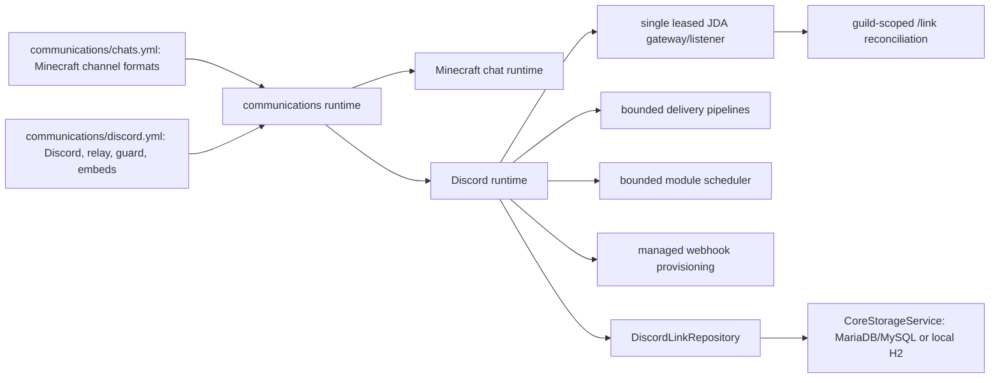

# TensaPlugin architecture, stability, and security audit

Audit date: 2026-08-09

Scope: TensaPlugin (Java 25 / Velocity 3.5 API) and the relevant TensaProxy
authentication and NeoForge advancement producer (Java 21 toolchain).

## Executive result

Chat and Discord now have one lifecycle owner, the neutral `communications`
module. Discord account links use `CoreStorageService` through JDBC instead of a
module-owned JSON file. Configuration schema v2 intentionally resets legacy
communications settings and links after a verified backup; it does not silently
carry unsafe or ambiguous old values forward.

Discord startup may degrade without disabling Minecraft chat. Targeted reload
validates a complete candidate before replacing the active runtime, and a failed
replacement restores the previous validated plan. The communications metrics
object survives that replacement, while JDA, listeners, queues, workers and
scheduled tasks belong to exactly one active runtime.

The follow-up chat/resource audit restored webhook-first player identity,
eliminated command-route formatting bypasses, emits real URL click components,
and consolidated delayed module work under one bounded scheduler. Operational
communications files now live under `communications/`.

The authentication investigation confirmed two causes consistent with offline
players becoming frozen after transfers: route aliases were incorrectly treated
as equivalent when they shared a signed backend ID, and a lost authentication
challenge had no bounded retry. LibreLogin now remains the sole route owner and
TensaProxy retries unanswered initial and renewal challenges without weakening
replay protection.

No deployment, proxy reload, proxy restart, or backend restart was performed.
Real guild permissions, Discord reconnect behavior and mixed premium/offline
player routing remain canary gates.

## Resulting architecture

There is no static relay sink between separately managed modules. Runtime state
is instance-owned and closed during replacement.

## Confirmed findings and resolutions

| Severity | Confirmed issue | Resolution |
| --- | --- | --- |
| Critical | Guild `/link` registration depended on relay-channel readiness, causing Discord to report that the command was unavailable. | Registration is guild-scoped and independent from relay availability. Ready, Resume and recreated connections run one coalesced, idempotent reconciliation that verifies the resulting command and reports safe failure classes. |
| High | Slow acknowledgement and duplicate JDA listeners could produce Discord error 10062. | Matching interactions are deferred ephemerally before storage/role work. A process-local token-fingerprint lease permits one JDA runtime per bot, and close rejects new events, removes the listener, shuts JDA down with a deadline and releases the lease. Tokens are never logged. |
| High | `links.json` was module-local, bounded only at file load and disconnected from configured core storage. | `DiscordLinkRepository` uses `<prefix>discord_links` through `CoreStorageService`. UUID and Discord user ID uniqueness is transactional; conflict results remain `PLAYER_ALREADY_LINKED` and `DISCORD_ALREADY_LINKED`. A bounded bidirectional index is updated only after commit. Link codes remain short-lived in-memory state. |
| High | Legacy communications values could be ambiguous and could preserve unsafe routing assumptions. | Schema v2 archives `discord.yml`, `chats.yml` and legacy `links.json`, verifies every copied SHA-256, then atomically writes clean defaults. No old communications value or link is imported. Future schema versions fail without changing files. |
| High | `chat-manager`/`chat` and `discord` were separate lifecycle owners. | They are replaced by one `communications` module. Root module flags migrate once with destination-wins semantics; if the destination is absent, legacy booleans are OR-combined before old keys are removed. |
| High | A syntactically valid YAML value with the wrong type could silently fall back to a Java default during reload. | `chats.yml` and `discord.yml` now receive strict annotated-field type validation before missing defaults are written. A type error aborts the candidate and leaves the old runtime active. |
| High | Reload could duplicate listeners, JDA sessions, slash registration, tasks or workers. | A serialized atomic runtime slot validates first, closes the old runtime, starts the candidate and rolls back from its previous validated plan on failure. Five consecutive replacement tests assert one instance of every owned resource. |
| High | Existing `lang/uk.yml` did not gain new bundled keys. | Runtime localization merges only missing bundled keys and preserves manual values. The real `discord_link_code` template and its MiniMessage `COPY_TO_CLIPBOARD` action are tested; the click payload is exactly the raw code. |
| High | Relay guard and shared Discord/chat settings had unclear ownership. | `discord.yml` owns Discord, `proxy_chat`, guard, delivery, embeds and diagnostics. `chats.yml` owns only `global`, `staff`, `alert`, `private` and `reply`. The guard supports both directions, `only`/`except`, and logical channel lists without blocking local Minecraft chat. |
| High | `/pm` was absent from the default private aliases, public command routes could bypass the shared formatter, and console-originated public commands emitted raw MiniMessage. | The known old alias set migrates to `pm,msg,tell,w` without replacing manual aliases. Every logical route resolves its format and relay policy from `communications/chats.yml`; private `to_format`/`from_format`, console and player paths all use one injection-safe component renderer. |
| High | Plain HTTP/HTTPS text had no Adventure click action, so the client could not open it even though the text was preserved. | The renderer detects bounded HTTP/HTTPS tokens after sanitization and inserts `OPEN_URL` plus hover actions while keeping all other user input literal. `/tensainfo communications` reports the number of URL actions produced; if that counter increases but clicks still fail, the remaining behavior is upstream client/modpack handling. |
| High | Minecraft-to-Discord identity formatting depended on a manually configured webhook and silently fell back to bot identity when it was absent or revoked. | Webhook remains the preferred transport with the in-game name and validated avatar URL. Opt-in `proxy_chat.webhook.auto_create` fetches a bot-owned webhook or creates one only with `MANAGE_WEBHOOKS`; 401/404 invalidates the runtime credential, performs one definite bot fallback and schedules coalesced recovery. |
| High | Persisting a generated webhook URL would have stored a live secret, while storing only an ID could not detect token rotation. | `<prefix>discord_webhook_bindings` stores route, webhook ID and a SHA-256 token fingerprint only. The token/URL exists only in the active runtime, is never rendered by `toString` or logs, and is re-fetched from Discord after startup/reconnect. |
| High | Root-level communications files did not follow module ownership and could diverge from newly generated defaults. | Existing schema-v2 root files are backed up, hash-verified and atomically relocated byte-for-byte to `communications/`. Destination-wins handling archives and removes obsolete root copies. Schema reset/future-version guarantees remain unchanged. |
| High | Reconnect, status polling, reply deletion, post-link retry and recovery each had separate scheduling/executor behavior. | `ModuleScheduler` owns bounded jobs with conditions, delay/interval, per-job/default attempts, exponential backoff, timeout, jitter, dead-letter handlers, pause/resume/cancel, scopes and dedupe keys. It now owns reconnect, status, reply deletion, webhook recovery, post-link effects, announcements and link-code cleanup. |
| High | Expired link codes were removed only when queried or reissued, allowing stale entries to accumulate across many disconnected players. | The registry has a hard capacity, purges expiry on issue and receives a lifecycle-owned periodic cleanup. Link indexes, queues, guard feedback, event state and scheduler work are all bounded. |
| Medium | Public `discord.yml` exposed implementation tuning that normal operators should not need. | Clean defaults retain only operational fields. Advanced scheduler/delivery/limit settings still accept validated manual overrides but are not emitted into new public defaults. |
| Medium | There was no live evidence for heap regression or retained Communications state. | Runtime-only telemetry records startup-to-live heap delta, heap percentage, chat/reply/link/guard state, scheduler jobs/queue/rejections and queue depths. Heap warnings are transition-only with recovery hysteresis, avoiding periodic log spam. |
| High | Discord delivery had duplicate-delivery risks and insufficient backpressure. | Ingress, normalization, formatting and delivery use bounded queues. Backoff with jitter is limited to definite retryable failures. Timeout/I/O does not trigger a second transport. Plain fallback is limited to local validation or definite Discord invalid-form responses. |
| High | Link completion effects could block linking or execute more than once. | Only a final new `LINKED` result enters a bounded post-link queue. Minecraft announcement is once-only and scope-filtered. Nickname sync is best effort, bounded to Discord's limit, retries transient errors only, and never rolls back a committed link. |
| High | Backend advancement text depended on whichever component title happened to be visible at runtime. | TDE2 carries locale, localized title and optional description. TensaProxy embeds SHA-1-verified `uk_ua`/`en_us` vanilla catalogs and loads bounded mod language catalogs; TensaPlugin accepts strict TDE1 and TDE2 frames for rolling compatibility. |
| Critical | Auth route suppression treated two Velocity routes sharing a backend ID as the same route. Offline-auth players could remain attached to a gameplay backend while its gate stayed locked. | The alias-route mutation was removed. LibreLogin owns auth/gameplay routing. A signed backend ID is cryptographic identity, not route identity; exact physical endpoint aliases require a distinct auth endpoint. |
| High | A dropped initial or lease-renewal challenge left a backend player locked until timeout. | TensaProxy retries unanswered challenges at a bounded interval no faster than five seconds. Session/challenge identity is retained, while each retry has a fresh message ID, nonce, timestamps and signature. Any valid bound `AUTH_STATE` stops retries; exact replay remains rejected. |
| High | Blocking I/O and unbounded executors/queues existed in event or command paths. | Core user/storage operations, Discord work, command queue, text reader, HTTP and RCON work use plugin schedulers or bounded executors with explicit rejection. Socket, HTTP, JDA shutdown and executor waits have finite bounds. |
| Medium | Message formatting and logs could expose injection or sensitive request details. | Visible MiniMessage text and quoted tag payloads use separate escaping. Allowed mentions are disabled. Logs contain transitions, safe failure classes and counters, never message bodies, tokens, webhook URLs, Discord IDs, signatures or keys. |
| Medium | `/tensainfo communications` existed only behind the shorter `/tinfo` primary command. | `/tensainfo` is now primary and `/tinfo` remains its compatibility alias; both are reserved against chat-command collisions. The snapshot contains only state, backend type, queue/counter metrics, latency and a safe failure class. |
| Medium | NeoForge `sourcesJar` consumed the generated language catalog without a Gradle task dependency, so clean builds could fail based on task order. | `sourcesJar` now explicitly depends on catalog generation, matching `processResources`; the full clean multi-project build is deterministic. |

## Authentication audit details

Premium accounts appeared less affected because they can bypass or complete a
different LibreLogin path; this was not evidence that the backend freeze guard
itself was account-type aware. The actual fault was route ownership combined
with fail-closed backend state. The fixes retain the intended security model:

- a backend locks a player immediately and unlocks only after a valid, bound,
  signed `AUTHORIZED` state;
- malformed, expired, cross-player, cross-session and replayed frames cannot
  unlock a player;
- authorization remains a renewable lease;
- authentication reload validates changes but deliberately does not replace
  active sessions or move/kick connected players;
- security/timing changes to the auth runtime require the next controlled proxy
  start and are reported as such.

The remaining topology rule is operationally important: if `auth` and a
gameplay server are merely two names for the same physical listener, Velocity
cannot perform a meaningful transfer between them. Configure a genuinely
distinct auth endpoint instead of restoring alias suppression.

## Configuration and storage contract

Both `communications/discord.yml` and `communications/chats.yml` require
`config_version: 2`.

- Version `<2` or a missing version triggers verified archival followed by
  clean v2 defaults. Existing values are not merged.
- Version `>2` fails fast and leaves every source file untouched.
- A partial archive failure leaves every original in place and does not write
  the replacement files.
- Legacy `links.json` is removed only after its verified copy exists and is
  never imported into JDBC storage. Users must link again.
- Secrets have no generated defaults. Environment overrides remain available.
- Root schema-v2 files are verified and relocated into `communications/`; if a
  destination already exists it wins and the obsolete root file is archived.
- Managed webhook storage contains only IDs and token fingerprints, never URLs
  or tokens. Auto-create remains disabled by default.
- Link persistence follows `storage.type`: configured MariaDB/MySQL when
  selected and available, otherwise local H2 according to core-storage rules.
- Manual runtime language translations are preserved while missing bundled
  keys are added.

Full operator notes are in [COMMUNICATIONS_V2_MIGRATION.md](COMMUNICATIONS_V2_MIGRATION.md).

## Reload, concurrency and delivery audit

- `/tensareload <module-id>` targets exactly one enabled module;
  `/tensareload all` handles all enabled modules. No argument remains a
  compatibility alias for `all`.
- Permissions are `tensa.reload` and `tensa.reload.<module-id>`, including tab
  completion filtering.
- Communications config parsing, type validation, MiniMessage parsing, Discord
  IDs, HTTPS URLs, placeholders, Discord limits, queue sizes and timing bounds
  are validated before runtime replacement.
- Chat can stay active while initial Discord startup is degraded. Targeted
  communications reload is stricter: an operational activation failure restores
  the previous runtime rather than accepting a new degraded candidate.
- Inbound relay rejects bot/webhook/self, wrong guild/channel, duplicate and
  guarded traffic. Rate-limited feedback deletion tasks are runtime-owned and
  cancelled on close.
- Metrics are module-owned, in-memory and monotonic across targeted reload;
  queues and workers are runtime-owned.
- Resource telemetry is safe and runtime-only. It reports counts and heap
  pressure transitions, never player/Discord identities or message bodies.
- Core authentication sessions, connected players and core storage are outside
  the communications replacement boundary.

## Verification

Final local gates:

- TensaPlugin with Java 25: `mvn -B clean test`,
  `mvn -B dependency:analyze`, and `mvn -B clean package`: 168 tests,
  0 failures/errors/skips, and no dependency problems.
- TensaProxy with its Java 21 toolchain: `gradlew.bat clean test build`.
  45 tests, 0 failures/errors/skips across testkit and NeoForge.
- Focused tests cover schema reset/archive failure/future rejection, H2 schema
  and conflicts, restart persistence, non-import of JSON, link completion
  effects, guard directions/scopes, definite versus ambiguous delivery failure,
  webhook binding/provisioning/revocation, route formatting, URL components,
  scheduler lifecycle, resource thresholds, embeds, metrics, five runtime replacements, auth transfer/retry/replay,
  MiniMessage clipboard behavior, and strict TDE1/TDE2 codecs/localization.
- Artifact hashes are recorded in the implementation handoff.

## Residual risks

1. Guild command permissions, role hierarchy, actual Discord rate limits and a
   real Ready/Resume cycle require a credential-safe canary.
2. The bot lease is process-local. Operations must guarantee that no second JVM
   or external service uses the same bot token.
3. Ambiguous network failures are intentionally not retried across transports;
   this chooses duplicate avoidance over guaranteed delivery.
4. Schema v2 intentionally discards old links and communications values after
   backup. Operators must configure v2 and plan a relink window.
5. Authentication topology cannot make two Velocity aliases of one physical
   endpoint behave like distinct transfer destinations.
6. Auth runtime settings are restart-required by design; targeted reload only
   validates them so live player sessions remain untouched.
7. Managed webhook creation requires `MANAGE_WEBHOOKS`. Without it, relay stays
   operational through bot delivery and diagnostics/logs expose only the safe
   failure class.

## Safe rollout and rollback

This procedure was not executed.

1. Archive the current receiver JAR and plugin data outside the live directory;
   record artifact hashes without printing config contents.
2. Confirm one process owns the Discord bot identity and prepare clean v2
   `communications/discord.yml` and `communications/chats.yml` values through a secure channel.
3. In a maintenance window, stop AeroProxy once, install the new TensaPlugin
   receiver, and start it once. Do not hot-swap the old JAR.
4. Verify the generated archive and SHA-256 manifest, core storage backend,
   `communications` diagnostics, guild-scoped `/link`, copy button, and TDE1
   reception. Keep new guard/announcement/nickname features disabled.
5. Test premium and offline accounts through login, auth-to-game transfer,
   gameplay server switch and lease renewal. No player may stay frozen after a
   completed transfer.
6. Open the relink window. Confirm new links survive a targeted communications
   reload and a controlled proxy restart before enabling link-required guards.
7. Canary relay in both directions, link announcement, nickname sync and typed
   embeds. Repeat communications reload five times and verify one JDA/listener/
   command/task set, scheduler counts and URL-component diagnostics via
   `/tensainfo communications`.
8. Only after the receiver is stable, install TensaProxy TDE2 on one backend,
   verify Ukrainian/local mod advancement text, then roll it out to the others.
9. Roll back in reverse order: restore TensaProxy to TDE1 first, then stop the
   proxy and restore the previous TensaPlugin JAR plus its archived old configs.
   The new `discord_links` table may remain unused. Do not feed a v2 config to an
   older receiver.
