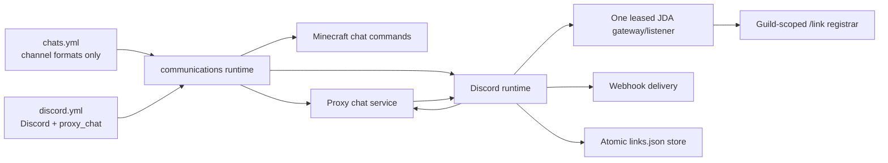

# TensaPlugin architecture, stability, and security audit

Audit date: 2026-08-02

Runtime target: Java 25, Velocity 3.5 API

Test baseline supplied for this work: 95 tests

Verified suite after remediation: 127 tests

## Executive summary

The chat and Discord implementations now have one lifecycle owner: the
`communications` module (`Communications`). Discord account linking no longer
depends on the relay channel being available, the guild-scoped slash command is
reconciled after JDA Ready/Resume/Recreate events, and every matching interaction
is deferred ephemerally before storage or Discord role work.

Module reloads run outside the Velocity event loop. Configured modules validate
YAML and semantic bounds before changing the active runtime. Runtime-owning
modules use a serialized replacement slot that stops the old runtime, activates
the validated plan, and restores the previous validated plan if activation
fails. If old-runtime shutdown itself fails, the slot is marked empty instead of
falsely reporting that the previous runtime was retained. The auth bridge
intentionally validates without replacing its session runtime, so connected
players and active authentication sessions are preserved; the command reports
that a proxy restart is required to apply changed auth settings.

No deployment, proxy reload, or proxy restart was performed as part of this
audit. Live Discord verification remains a deployment gate because the test
suite does not use production credentials or make guild mutations.

## Resulting communications architecture

There is no static chat sink connecting separate runtime modules. Relay
callbacks are instance-owned inside one active communications runtime.

## Confirmed findings and remediation

| Severity | Finding | Resolution |
|---|---|---|
| Critical | Guild `/link` registration was skipped when the configured relay channel was missing, producing “This command is not available in this server.” | Guild availability now controls command registration; relay-channel readiness is checked independently. |
| High | Slash registration happened only during the initial connection and was not reconciled reliably after JDA reconnects. | Ready, Resume, and Recreate all invoke an idempotent guild registrar. It lists current commands, detects foreign name collisions, removes stale Tensa-owned commands, upserts only when required, and verifies the returned command definition. Concurrent registration attempts coalesce. |
| High | Error 10062 was possible when an interaction was acknowledged too late or two listeners/runtimes consumed the same bot interaction. | Matching interactions defer ephemerally before validation, storage, or role calls. A process-wide bot-token fingerprint lease rejects a second JDA runtime without retaining or logging the token. Close disables event acceptance, removes the listener, shuts JDA down with a deadline, and releases the lease. |
| High | A communications reload could duplicate JDA, listeners, tasks, or commands. | Serialized runtime replacement never overlaps old and new runtimes. Failed activation restores the previous validated plan; failed rollback disables the module instead of falsely reporting success. Repeated lifecycle tests assert a maximum of one listener, task, command, and bot runtime. |
| High | `src/main/resources/langs/uk.yml` did not update an existing runtime `lang/uk.yml`. | Runtime language synchronization adds missing bundled keys and preserves every existing manual translation. The real `discord_link_code` template is tested. |
| High | Chat and Discord were separate runtime modules connected through shared/static state. | `chat-manager`/`chat` and `discord` were replaced by the neutral `communications` module. Chat and Discord classes remain implementation packages, not independently managed runtimes. |
| High | Discord relay settings were split between `chats.yml` and `discord.yml`. | `discord.yml` owns Discord and `proxy_chat`; `chats.yml` owns only `global`, `staff`, `alert`, `private`, and `reply` channels and formats. |
| High | MiniMessage values used inside quoted click arguments could break out of the tag; using one escape mode for both visible text and click payload also corrupted displayed quotes. | Visible text and quoted tag arguments now use separate escaping. New defaults use `{message_payload}` for click payloads. Exact known legacy defaults are upgraded; manual formats are untouched. Tests deserialize the actual configured template, reject injected `run_command`, preserve visible text, and assert the exact clipboard payload. |
| High | Several module reloads used disable-then-enable without preflight or rollback. | All discovered modules implement a targeted reload path. YAML-backed modules use read-only syntax preflight plus semantic validation/immutable plans. Runtime-owning modules use transactional replacement; immutable RCON-manager settings swap atomically. `/tensareload all` reports module failures instead of always claiming success. |
| High | Synchronous database/file work occurred in Velocity command or event callbacks. | User-meta, command-queue, text-reader, and RCON-manager work is dispatched through plugin schedulers or bounded worker executors. Command invocations are snapshotted before asynchronous execution. |
| High | Worker pools and queues could grow without explicit backpressure. | User-data, legacy database, HTTP, RCON-manager, Discord inbound, Discord outbound, and Discord-link work now have bounded workers/queues. Rejection produces a failed future or a rate-limited operator/user message. Netty RCON worker count is capped. |
| Medium | A failed webhook request always fell back to the bot, which could duplicate a message after an ambiguous timeout/network failure. | Bot fallback happens only after a definite non-2xx webhook response. Ambiguous I/O/timeouts are not retried or sent through a second transport. |
| Medium | HTTP/request debug logs could expose query strings, webhook credentials, response secrets, or rendered commands. | Logged URLs drop userinfo/query data and redact Discord webhook paths. Response bodies and rendered commands are not logged. Sensitive response keys are masked and exception details are reduced to safe types. |
| Medium | Internal command registration silently unregistered colliding tracked commands. | Registration now fails on a case-insensitive primary/alias collision. Unregister no longer removes an untracked command that may belong to another plugin. |
| Medium | Player/meta state could remain cached after disconnect. | Disconnect evicts session, persistent, and pending user-meta cache entries. Communications already removes per-player chat state. |
| Medium | `links.json` accepted unbounded input. | Load is limited to 16 MiB and 100,000 bindings. Writes remain temporary-file + fsync + atomic move where supported. |
| Medium | Linked-role reconciliation blocked its single worker once per account and repeated warnings per failure. | Reconciliation is coalesced and composed asynchronously in sequence; close prevents further role steps and failures produce one aggregate warning. |
| High | RCON login limiting keyed clients by remote address including ephemeral port and kept unbounded maps. | The limiter keys by IP, has bounded LRU-style state, retains block windows across reconnect ports, and has unit coverage. |
| High | RCON frame sizes and outbound RCON response allocations were insufficiently bounded; outbound sockets could leak on auth/command exceptions. | Server frames require the protocol minimum and retain a maximum. Client packets have per-frame and aggregate bounds, validate terminators, close through `AutoCloseable`, and zero the temporary password bytes. |
| Medium | RCON and compatibility-bridge diagnostics logged complete commands. | Logs contain only the command label, never arguments that may contain secrets. |
| Low | Guava was used directly but only available as an undeclared Velocity transitive dependency. | Guava is declared explicitly with provided scope; `mvn dependency:analyze` reports no dependency problems. |

## Discord linking behavior

1. Minecraft `/discord link` issues a short-lived code.
2. The localized message shows the code plus a visible copy button.
3. The click event uses `COPY_TO_CLIPBOARD` and contains only the raw code.
4. Discord `/link code:<code>` is guild-scoped and immediately deferred as an
   ephemeral interaction.
5. Linking/storage work runs on the bounded link executor.
6. `links.json` is updated atomically; an optional linked role is reconciled
   asynchronously.

The registrar uses a Tensa ownership marker in the command description. A
foreign command with the configured name is reported as a collision and is not
deleted.

## Reload contract

Command forms:

- `/tensareload <module-id>` reloads exactly one enabled module.
- `/tensareload all` reloads core presentation/config state and all enabled
  modules, reporting any module IDs that failed.
- No argument remains a backwards-compatible alias for `all`.

Permissions:

- `tensa.reload` allows every target and `all`.
- `tensa.reload.<module-id>` allows only that module and controls tab completion.

Module-specific behavior:

| Module | Reload behavior |
|---|---|
| `communications` | Validates `chats.yml`, `discord.yml`, MiniMessage formats, limits, credentials, and link storage; replaces chat/Discord/JDA as one runtime with rollback. |
| `librelogin-auth-bridge` | Validates YAML and security/timing bounds while keeping the current runtime and auth sessions intact. Security-sensitive runtime changes take effect on the next controlled proxy start. |
| `proxy-bridge` | Validates an immutable security/channel plan, then replaces channel/listener/command with rollback. |
| `command-queue` | Validates bounded queue settings and replaces manager/listener/task/command with rollback; persisted entries remain in core storage. |
| `rcon-manager` | Atomically swaps an immutable target map; its bounded executor and command remain active. |
| `rcon-server` | Validates listener settings, rebinds, and restores the prior listener plan if the new bind fails. |
| `request-module` | Preflights every request YAML, validates unique command triggers, then swaps configs/commands with rollback. |
| `text-reader` | Validates the command filename set and swaps commands with rollback. File reads remain off the event loop. |
| `player-time` | Rebinds stateless commands through the same rollback mechanism; core user storage is unchanged. |

Targeted reload does not rebuild core storage, close authentication sessions,
disconnect players, or call a proxy/server restart API.

## Configuration migration notes

Migration runs before the main app config removes unsupported legacy module
keys. It is idempotent and follows destination-wins semantics:

- `modules.chat-manager`, older `modules.chat`, and `modules.discord` are folded
  into `modules.communications`; an existing `communications` value is kept.
- Legacy Discord enabled state is copied to `discord.yml` root `enabled` only
  when that destination is absent.
- Legacy chat enabled state is copied to `chats.yml` root `enabled` only when
  that destination is absent.
- `chats.yml` `proxy` moves to `discord.yml` `proxy_chat`.
- These values move without transformation: `enabled`, `excluded_servers`,
  `server_aliases`, `max_length`, `cooldown_millis`,
  `duplicate_window_millis`, `max_repeated_characters`, `format`,
  `discord_format`, `cooldown_message`, and `duplicate_message`.
- Existing destination values win key by key, including nested maps such as
  `server_aliases`; missing nested keys are merged without replacing live keys.
- The destination is saved and validated before the legacy source block is
  removed, so an interrupted migration can be retried.
- `links.json`, guild/channel/role IDs, webhook configuration, environment
  references, formats, and unrelated manual settings are not rewritten.
- Missing runtime localization keys are added; existing translations are not
  overwritten.
- Only the exact previously generated private/reply click formats are upgraded
  to `{message_payload}`. Any manually changed format remains untouched.

## Concurrency, delivery, and shutdown review

- Discord inbound and outbound delivery use bounded single-consumer queues,
  preserving order per direction and providing explicit backpressure.
- JDA handles its own Discord REST rate-limit queues; Tensa additionally bounds
  its producer queues and announcement rate.
- Allowed mentions are empty for bot and webhook sends, preventing mention
  amplification.
- Inbound loop guards reject bot, webhook, self, wrong-guild, wrong-channel, and
  duplicate backend events.
- Reconnect waits, delivery waits, HTTP requests, backend probes, executor
  shutdown, JDA shutdown, and RCON socket operations have finite bounds.
- Communications shutdown first rejects new work, unregisters commands/tasks/
  listeners/channels, then closes the Discord runtime and JDA lease.
- Command-queue runtimes mark themselves closed so already-scheduled callbacks
  cannot dispatch again after replacement.
- Module state, command tracking, and module registry snapshots are synchronized
  for reload/event concurrency.

## Verification evidence

Executed locally with Java 25:

- `mvn -B test`: 127 tests, 0 failures, 0 errors, 0 skipped.
- `mvn -B dependency:analyze`: no dependency problems found.
- Focused coverage includes localization merging, the actual Discord link
  MiniMessage template, quoted MiniMessage injection, link-code lifecycle,
  atomic link storage, slash registration and collisions, immediate defer,
  JDA/runtime replacement, config migration, targeted permissions/isolation,
  repeated replacement without duplicate resources, YAML preflight, webhook
  duplicate avoidance, RCON login limiting, and RCON packet bounds.

## Residual risks and operational gates

1. Live guild command creation, Discord permissions, role hierarchy, gateway
   intents, and real reconnect behavior cannot be proven without connecting the
   configured bot. They require the canary checks below.
2. The bot lease is process-local. A second JVM, old proxy process, staging
   instance, or unrelated service using the same token can still cause duplicate
   interaction consumption and Error 10062. Operations must guarantee one live
   process per bot token.
3. Discord has no application-level idempotency key shared between webhook and
   bot transports. Ambiguous webhook failures are dropped rather than retried;
   this prefers no duplicate delivery over at-least-once delivery.
4. Auth-bridge targeted reload validates but deliberately does not rebuild the
   live auth runtime. This preserves sessions; changed handshake/security values
   become active after a controlled proxy restart. The reload command reports
   this state explicitly instead of claiming that the module was reloaded.
5. Generic startup-time `YamlBackedFile` recovery still backs up and regenerates
   malformed legacy/core configs. Module reload paths preflight first and do not
   invoke that recovery for malformed module YAML.
6. The generated RCON server config contains a placeholder password. Keep the
   module disabled or replace it with a strong unique secret before enabling it.

## Safe deployment and rollback plan

This plan is intentionally not executed by the audit.

1. Build and archive the Java 25 artifact; record its SHA-256.
2. Before the maintenance window, make access-controlled backups of the current
   JAR and `config.yml`, `chats.yml`, `discord.yml`, `lang/uk.yml`, and
   `links.json`. Do not print file contents or secrets into logs/chat.
3. Confirm there is exactly one configured process using the Discord bot token.
4. Stop AeroProxy completely. Do not use Velocity/plugin reload to replace the
   older live JAR; restarting that old JAR cannot include these fixes.
5. Replace the JAR atomically while retaining the current plugin data directory,
   then start AeroProxy once.
6. Confirm logs report the `communications` module, a connected configured guild,
   and `/link registered and verified` or `/link verified`. There must be no bot
   lease collision, command collision, or repeated registration loop.
7. In Minecraft, run `/discord link`; confirm the button is visibly clickable
   and the clipboard contains only the displayed code.
8. In the configured Discord guild, run `/link` with that code; confirm an
   immediate ephemeral response, persisted linking after a reconnect, and the
   configured role if enabled.
9. Send one relay message in each direction and one event announcement. Confirm
   no echo, duplicate webhook/bot delivery, mention expansion, or cross-channel
   leakage.
10. Run `/tensareload communications` repeatedly during the canary and verify one
    JDA session/listener, one slash-command definition, one relay delivery, and
    no player disconnect/auth-session reset.
11. If rollback is required, stop AeroProxy, restore the old JAR and the backed-up
    legacy config files, retain the newest valid `links.json` because its format
    is unchanged, and start once. Never hot-swap between these module schemas.
